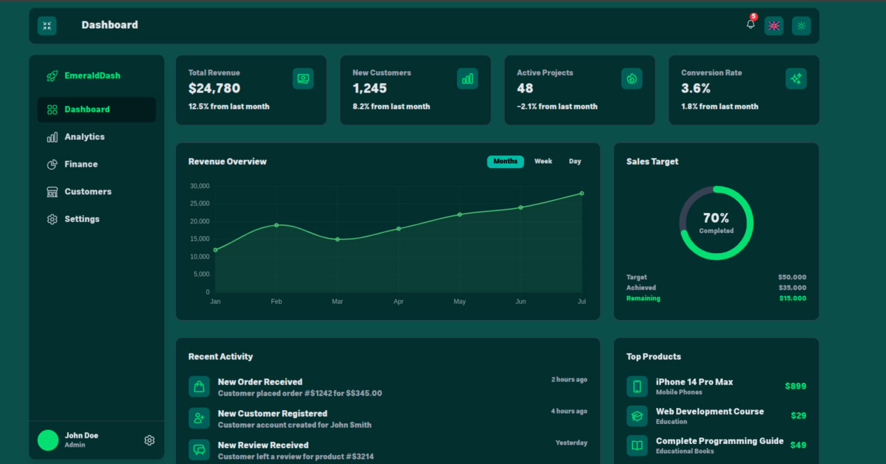

# 🌐 Vue 3 Admin Dashboard (TypeScript + i18n + Responsive)

A professional **Vue 3 admin panel** with full **TypeScript** support and **multi-language (i18n)** support — built for modern developers who need speed, scalability, and clean design.

> ⚡ Perfect for dashboards, web apps, CMS panels, and internal admin tools.



---

# 📌 پنل مدیریت ویو ۳ (تایپ‌اسکریپت + چندزبانه + ریسپانسیو)

یک پنل مدیریتی حرفه‌ای با استفاده از **Vue 3**، پشتیبانی کامل از **TypeScript** و سیستم **چندزبانه (i18n)**. مناسب برای توسعه‌دهندگان حرفه‌ای که دنبال سرعت، سادگی و طراحی تمیز هستند.

> ⚡ ایده‌آل برای پنل‌های مدیریت، سیستم‌های مدیریت محتوا، وب‌اپلیکیشن‌ها و ابزارهای داخلی سازمانی.


---

## 🔑 Features | امکانات

- ✅ Vue 3 + Composition API
- ✅ TypeScript Integrated
- ✅ Multi-language support with i18n
- ✅ Responsive design (Mobile friendly)
- ✅ Modular folder structure
- ✅ Customizable components
- ✅ Dark Mode included

---

## ⚙️ Tech Stack | تکنولوژی‌ها

- [Vue 3](https://vuejs.org/)
- [TypeScript](https://www.typescriptlang.org/)
- [Vite](https://vitejs.dev/)
- [Vue Router](https://router.vuejs.org/)
- [Vue I18n](https://vue-i18n.intlify.dev/) (for multilingual support)

---

## 🧩 Folder Structure | ساختار پروژه

```bash
src/
├── assets/
├── components/
│   └── NavigationMenu.vue
├── i18n/
│   └── en.json
│   └── fa.json
├── layouts/
├── pages/
├── stores/
├── App.vue
├── main.ts
